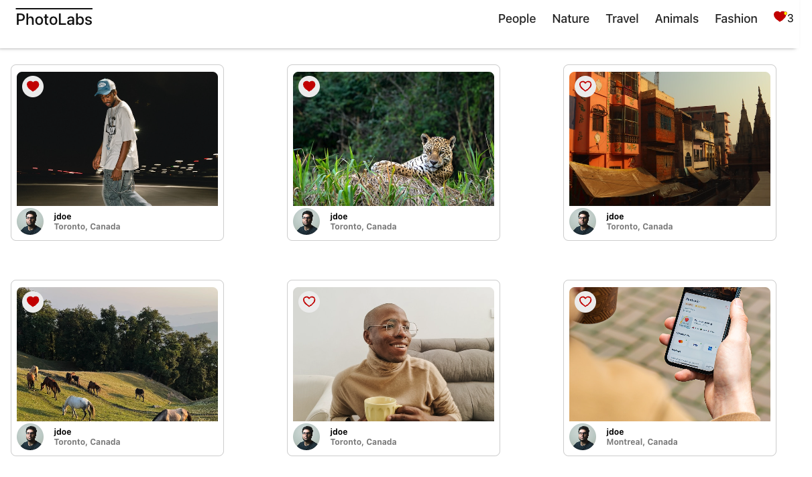
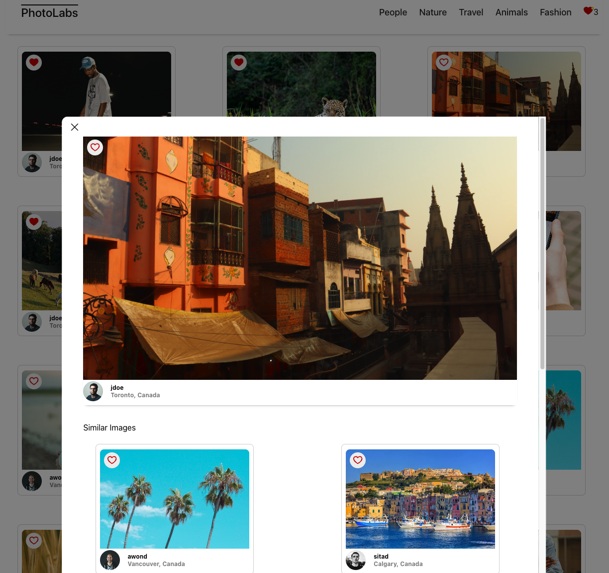
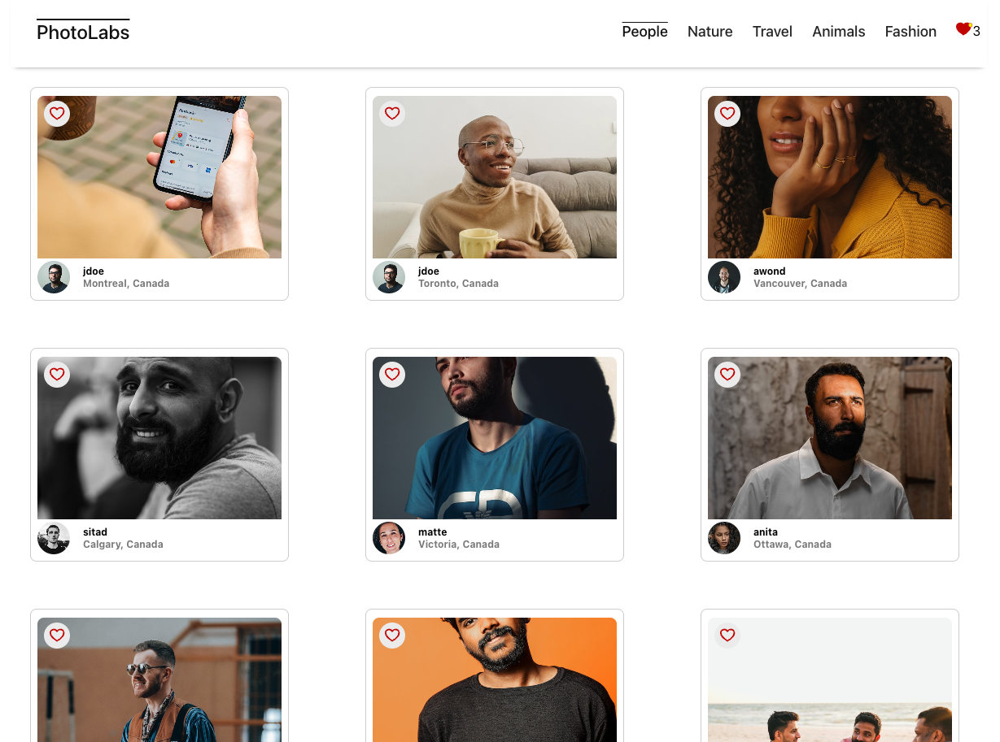

# PhotoLabs!

A single-page application built with React, PhotoLabs enables users to browse and interact with photos based on various themes.

# Functional Requirements

The data for the application is stored in a PostgreSQL database.
The API server is implemented using Node Express.js.
The client communicates with the API server over HTTP and uses JSON for data exchange

# Behavioural Requirements

Users can browse photos displayed on the homepage, which are fetched from the API.
Users can explore photos categorized by different topics.
Clicking on a photo opens a larger version along with related or similar photos.
Users have the ability to 'like' photos from any section of the application.
A heart icon in the navigation bar indicates if the user has liked any photos, and shows a notification for the same.
The navigation bar provides options to explore different photo topics and also features the heart icon.
The application uses API calls to maintain user data, ensuring it persists even after a browser refresh.


# Technical Specs

The client-side application is created using Create React App (CRA).
The API server is implemented using Express.
During development, two separate servers were utilized:
A Webpack development server for client-side development
An API server to manage and serve photo data

## Tech Stack

<p align="left">
  <a href="https://skillicons.dev">
    
  </a>
</p>

## Setup

To install dependencies, run npm install in both the /frontend and /backend directories.

## [Frontend] Running Webpack Development Server

```sh
cd frontend
npm start
```

## [Backend] Running Backend Servier

Read `backend/readme` for further setup details.

```sh
cd backend
npm start
```
## Application Screenshots

### PhotoLabs Home Page


### User can favourite photos, which are stored accross the app. Notification and counter for the number of fav photos in nav bar.



###  Larger photo view in modal that shows similars based on topic



###  User can filter all photos in home bage pased on topics clicked in the nav bar



# Thanks!